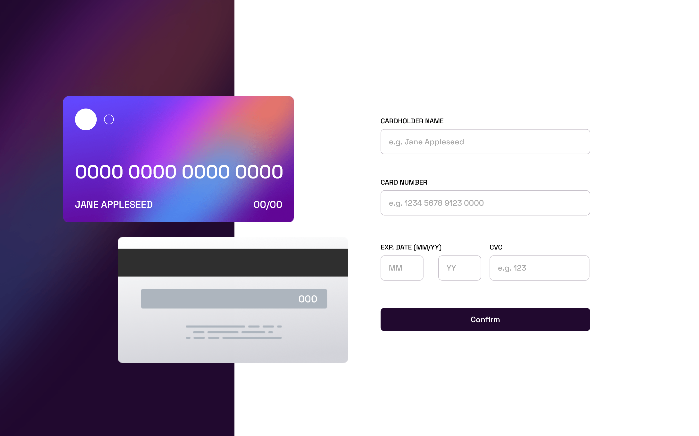

# Frontend Mentor - Interactive card details form solution

This is a solution to the [Interactive card details form challenge on Frontend Mentor](https://www.frontendmentor.io/challenges/interactive-card-details-form-XpS8cKZDWw). Frontend Mentor challenges help you improve your coding skills by building realistic projects.

## Table of contents

- [Overview](#overview)
  - [The challenge](#the-challenge)
  - [Screenshot](#screenshot)
  - [Links](#links)
- [My process](#my-process)
  - [Built with](#built-with)
  - [What I learned](#what-i-learned)
  - [Useful resources](#useful-resources)
- [Author](#author)

## Overview

### The challenge

Users should be able to:

- Fill in the form and see the card details update in real-time
- Receive error messages when the form is submitted if:
  - Any input field is empty
  - The card number, expiry date, or CVC fields are in the wrong format
- View the optimal layout depending on their device's screen size
- See hover, active, and focus states for interactive elements on the page

### Screenshot



### Links

- Solution URL: [Add solution URL here](https://your-solution-url.com)
- Live Site URL: [Here](https://michaelatrinh.github.io/interactive-card-details-form)

## My process

### Built with

- Semantic HTML5 markup
- CSS custom properties
- Flexbox
- Mobile-first workflow
- [TypeScript](https://www.typescriptlang.org/)
- [React](https://reactjs.org/) - JS library
- [React Hooks](https://reactjs.org/docs/hooks-intro.html) - State changes
- [Sass](https://sass-lang.com/) - For styles
- [RegEx](https://regex101.com/)

### What I learned

This is my first project in which I tried to learn how to use the useReducer React hook to change the project component states.

```js
function reducer(state: string | number, action: any) {
  switch (action.type) {
    case "updateName":
      let uppercaseName = action.payload.name.toUpperCase();
      return (mutatedState.newState.name = uppercaseName);
    case "updateNumber":
      if (isNaN(action.payload.number))
        invalidMsgs.invalidNumber = "Wrong format, numbers only";
      if (!isNaN(action.payload.number)) {
        invalidMsgs.invalidNumber = "";

        let v: string = action.payload.number
          .replace(/\s+/g, "")
          .replace(/[^0-9]/gi, "");
        let matches: RegExpMatchArray | null = v.match(/\d{1,16}/g);
        let match: string = (matches && matches[0]) || "";
        let parts: string[] = [];

        for (let i: number = 0, len = match.length; i < len; i += 4) {
          parts.push(match.substring(i, i + 4));
        }

        if (parts.length) {
          return (mutatedState.newState.number = parts.join(" "));
        } else {
          return state;
        }
      }
      break;
    case "updateMM":
      if (isNaN(action.payload.eMM) || action.payload.eMM > 12)
        invalidMsgs.invalidExpiry = "Invalid month";
      if (!isNaN(action.payload.eMM) && action.payload.eMM < 13) {
        invalidMsgs.invalidExpiry = "";
        return (mutatedState.newState.eMM = action.payload.eMM);
      }
      break;
    case "updateYY":
      if (isNaN(action.payload.eYY) || action.payload.eYY < 22)
        invalidMsgs.invalidExpiry = "Invalid year";
      if (!isNaN(action.payload.eYY) && action.payload.eYY > 21) {
        invalidMsgs.invalidExpiry = "";
        return (mutatedState.newState.eYY = action.payload.eYY);
      }
      break;
    case "updateCVC":
      return (mutatedState.newState.cvc = action.payload.cvc);
    default:
      return state;
  }
}
```

### Useful resources

- [Format Credit Card Number](https://stackoverflow.com/questions/36833366/format-credit-card-number) - This helped me manipulate the credit card string to insert whitespaces between every 4th digit on the interactive card component.
- [Learn useReducer In 20 Minutes](https://youtu.be/kK_Wqx3RnHk) - This got me started in understanding how to use the useReducer React hook for this project.

## Author

- Website - [Michael Alexander Trinh](https://michaelatrinh.vercel.app)
- Frontend Mentor - [@michaelatrinh](https://www.frontendmentor.io/profile/michaelatrinh)
- LinkedIn - [Michael Alexander Trinh](https://www.linkedin.com/in/michaelatrinh)
